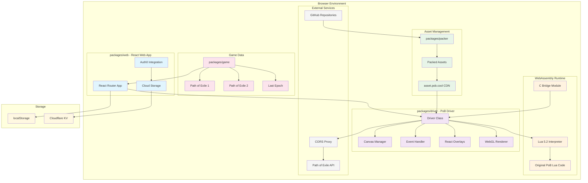

# pob.cool - Path of Building for browser environment

[](https://wakatime.com/badge/user/018dace5-5642-4ac8-88a7-2ec0a867f8a7/project/fa7418b8-8ddb-479c-805b-ce2043f24d24)

This is browser version of [Path of Building](https://pathofbuilding.community/).

## Features

- Run the PoB in your browser, that's all.
- You can select the version of the PoB to run.
- Saved builds are stored in the browser's local storage.
   - The `Cloud` folder appears when you are logged into the site. Builds saved there are stored in the cloud and can be accessed from anywhere.
- You can load a build by specifying a hash in the URL.
   - eg. https://pob.cool/#build=https://pobb.in/WwTAYwulVav6

## Limitations

- Network access is through our CORS proxy, so all users have the same source IP. This will likely cause rate limiting.
- For security reasons, requests containing the POESESSID cookie will be unconditionally rejected. Do not enter POESESSID in the PoB of this site.

## Principle

- We will not make any changes to the original PoB. This is because a lot of effort has been put into the PoB itself and
  we want the community to focus on developing the offline version.
  - However, it does make changes in behavior that are possible without changing the code.

## Development

### Prerequisites

- [Mise](https://mise.jdx.dev/)

### Clone the repository

This repository includes a [submodule](https://gist.github.com/gitaarik/8735255) in `vendor/lua`. To include the submodule when cloning the repository, use the `--recurse-submodules` flag:

```bash
git clone --recurse-submodules <repository-url>
```

If you omitted the flag, you can use the following commands to clone the submodule:

```bash
git submodule init
git submodule update
```

### Install dependencies

```bash
mise install
hk install --mise
```

### Pack upstream PoB

Before running the development server, you need to pack the upstream PoB assets into a structure that the driver can use.

```bash
mise run pack --game poe2 --tag v0.8.0
```

### Run driver shell

Set up a development server for the PoB web driver alone.

```bash
mise run driver:dev --game poe2 --version v0.8.0
```

### Run web app

Set up a web application development server.
You need to build the driver first.

```bash
mise run web:dev
```

### pob.cool maintenance for owners

If you are the owner of pob.cool, you can set `MISE_ENV=pob-cool` to enable mise tasks.

## Architecture



## Under the hood

### Core Architecture

**WebAssembly Runtime**: The heart of pob-web is a custom Lua 5.2 interpreter compiled to WebAssembly using Emscripten. This allows the original Path of Building Lua codebase to run unmodified in the browser, maintaining 100% compatibility with the desktop version.

**C Bridge Layer**: A critical component written in C (`packages/driver/src/c/`) acts as a bridge between the Lua runtime and the JavaScript driver. This includes:
- Custom implementations of PoB's graphics modules (equivalent to SimpleGraphic)
- File system abstraction using Emscripten's WASMFS
- Memory management and data marshaling between Lua and JavaScript contexts

**JavaScript Driver**: The `packages/driver` emulates the desktop PoB window environment using vanilla JavaScript and WebGL:
- **Canvas Management**: Handles multiple rendering contexts and viewport management
- **Event System**: Translates browser events (mouse, keyboard, touch) to PoB-compatible input
- **WebGL Renderer**: Hardware-accelerated rendering pipeline that interprets PoB's drawing commands
- **React Overlays**: Mobile-optimized UI components (virtual keyboard, zoom controls) with scoped CSS

### Asset Pipeline

**Upstream Integration**: The `packages/packer` tool automatically processes releases from upstream PoB repositories:
- Downloads and extracts game assets, Lua scripts, and data files
- Compresses textures and optimizes assets for web delivery
- Generates manifest files for efficient loading
- Supports multiple games (PoE1, PoE2, Last Epoch) with version management

**Content Delivery**: Assets are served via CDN (asset.pob.cool) in production, with local filesystem fallback during development using Vite's virtual filesystem.

### Web Application

**React Frontend**: The `packages/web` provides the user-facing application:
- React Router v7 with server-side rendering capabilities
- Cloudflare Pages deployment with Workers functions for API endpoints
- Auth0 integration for user authentication and cloud storage
- Build management with localStorage and optional Cloudflare KV cloud sync

### Key Engineering Challenges Solved

1. **Memory Management**: Efficient data transfer between WebAssembly heap and JavaScript objects
2. **Graphics Translation**: Converting PoB's immediate-mode graphics calls to WebGL draw commands
3. **File System Emulation**: Providing a POSIX-like filesystem interface within browser constraints
4. **Mobile Adaptation**: Touch-friendly overlays without modifying the original PoB interface
5. **Network Isolation**: CORS proxy for external API calls while maintaining security
6. **Asset Optimization**: Balancing file size with loading performance for large game databases

This architecture enables running complex desktop software in the browser while maintaining the principle of zero modifications to the original PoB codebase.
